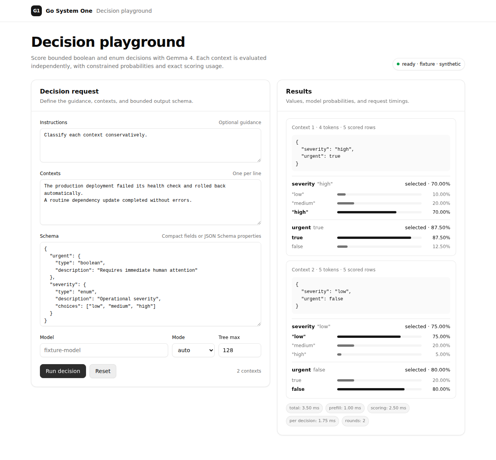

# Go System One

Go System One runs Gemma 4 12B as a finite-choice decision model. A request contains context and a set of boolean or string-enum fields. The model scores the allowed values and returns a selected value and probability for each field.

[](docs/playground.md)

## From Gemma to a native Go runtime

Development started with a fixed Gemma 4 12B baseline: one model, tokenizer, chat template and quantised GGUF file. The Gemma weights supply the pretrained knowledge used to score each choice.

We then built a llama.cpp prototype around the same model. It fixed the prompt format and candidate token paths, and provided reference decisions and probabilities. Its 96.0 ms result on the pinned test request became the first performance target. Frozen results from that prototype still provide an independent check for the Go implementation.

Next, we replaced the llama.cpp runtime with native Go code. It loads the GGUF and tokenizer files, builds a shared prompt prefix and scores only the token paths allowed by the request schema. The CPU/SIMD path is a slow numerical reference.

The NVIDIA path runs hand-tuned kernels directly from Go. The Go code loads embedded PTX through the NVIDIA Driver API and launches the kernels. It does not use CGo, llama.cpp or a CUDA toolkit at run time. Performance changes include:

- keep projection weights and the KV cache on the device;
- reuse the shared schema prefix;
- score independent candidate branches in packed batches;
- project only the vocabulary rows needed by those candidates;
- tune Q4, Q5, Q6, attention and activation kernels for the target GPU.

On the pinned RTX 3060 test, the early native path took about 521 ms. Later changes reduced this to about 136 ms and then to an 81.13 ms median. The current Go/PTX path is faster than the 96.0 ms llama.cpp reference for this request.

## Decision model

The HTTP service exposes `POST /v1/decision`. The scorer supports boolean fields, unordered string enums and up to 256 contexts in one request. It validates the schema before tokenisation and restricts output to the candidate paths in that schema.

The term *Jev-like* describes this finite-choice interface. The model uses the pinned Gemma weights. It has no Jev weights, Jev training or Jev pointer head.

Returned probabilities are model probabilities over the allowed candidates. They have not been calibrated against a labelled test set. See [`docs/jev-like.md`](docs/jev-like.md) for the request limits and model details.

## Performance

One warm-up request followed by 100 sequential HTTP requests on an RTX 3060 produced these handler times:

| Runtime | Warm latency |
|---|---:|
| llama.cpp prototype | 96.0 ms |
| Early native Go/NVIDIA path | 520.8–521.9 ms |
| Native path before later kernel work | 135.3–136.7 ms |
| Current Go/PTX path | 81.13 ms median; 81.59 ms p95; 82.15 ms p99 |

All 100 current responses selected `urgent=true`. The measurements used one pinned model, request and host. They cover latency only. Task accuracy and concurrent throughput require separate tests.

[](docs/benchmarks/README.md)

[](docs/benchmarks/README.md)

The charts are generated from committed JSON. [`docs/benchmarks/README.md`](docs/benchmarks/README.md) records the full sample, request, scaling tests, limits and reproduction commands.

## Build

Use Go 1.26.2 or the version declared in `go.mod`.

```sh
make prerequisites
make setup
```

The model and tokenizer are separate downloads. [`docs/artifacts.md`](docs/artifacts.md) lists their repositories, revisions, filenames, sizes and SHA-256 values.

```sh
make artifacts-info
make artifacts-download ACCEPT_GEMMA_LICENSE=1 HF_TOKEN="$HF_TOKEN"
make artifacts-verify
```

`ACCEPT_GEMMA_LICENSE=1` records that you accepted the Gemma licence before downloading. Model, tokenizer and GGUF files are excluded from source control and release archives.

## Run

```sh
make run BACKEND=nvidia LISTEN=127.0.0.1:8080
```

To use files from another directory:

```sh
make run \
  BACKEND=nvidia \
  LISTEN=127.0.0.1:8080 \
  MODEL=/path/to/model.gguf \
  TOKENIZER_DIR=/path/to/tokenizer
```

The command verifies all pinned artifact hashes before loading the model. Open `http://127.0.0.1:8080/go-system-one` for the playground. [`docs/playground.md`](docs/playground.md) describes its browser tests, theme behaviour and screenshots.

`BACKEND=simd make run` selects the CPU/SIMD reference. Gemma 4 12B is too slow on this path for interactive use.

The server has no authentication or TLS. Bind it to loopback or place an authenticated reverse proxy in front of it.

## Test

The default checks use synthetic or committed fixtures and do not download model files.

```sh
make test
make race
make check
make cross-build
make browser-test
```

NVIDIA tests for the pinned model require its artifacts and compatible hardware:

```sh
make hardware-check
```

The [v1 model report](docs/validation/go-system-one-v1-20260921.md) records the model pins, llama.cpp comparisons and numerical limits. The [standalone NVIDIA report](docs/validation/standalone-nvidia-f65652f6-20260922.md) records the 100-request run.

## Source updates

This repository contains all Go source needed to build the service. Third-party Go modules and their licences are stored under `vendor/`.

Development also takes place in [`go-pherence`](https://github.com/rcarmo/go-pherence). Most imported source is pinned to [`788f22402d928004a597b1446568f0e0595dfb1c`](https://github.com/rcarmo/go-pherence/commit/788f22402d928004a597b1446568f0e0595dfb1c). The probability API and playground files are pinned separately to [`c84a151dd8e7f952bc6b3aba35f1d309e79016f3`](https://github.com/rcarmo/go-pherence/commit/c84a151dd8e7f952bc6b3aba35f1d309e79016f3). The source manifest lists each imported path and any per-file revision.

```sh
./scripts/update-upstream.sh <full-go-pherence-commit>
```

The script copies listed files in one direction, records the source commit, rebuilds `vendor/` and runs the offline checks. It does not write to the `go-pherence` checkout. [`docs/upstream.md`](docs/upstream.md) defines the review procedure.

## Packages and releases

`make package` creates code-only Linux archives under `dist/`. [`docs/releases.md`](docs/releases.md) lists the archive checks and release process. Run `make help` for all available targets.

## Licence

Go System One is available under the [MIT licence](LICENSE).
