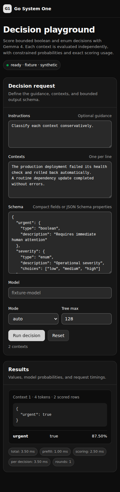

# Decision playground

The embedded playground at `/go-system-one` provides a browser form for `POST /v1/decision`. It submits boolean and string-enum schemas to the same loopback service. The separate [TypeSafe route](systemone-api.md), `POST /v1/systemone`, accepts Noul, Choice and Score requests through HTTP; the playground does not expose those types yet.

## Appearance

The page follows the neutral OKLCH palette, typography and controls used by the ported llama-ui. System text is used for labels and prose; monospace text is limited to structured values and code-like output.

Appearance follows the operating-system `prefers-color-scheme` setting. The page has no theme toggle, local-storage key or persisted theme override.

### Light desktop


- OS preference: light
- viewport: 1280 px wide
- full-page output: 1280 × 1190
- device pixel ratio: 1
- SHA-256: `1dbe325f2b9e00dcb5a49836bf3f9cf6147eebc23c5d979e53cecd7c693070cc`

### Dark mobile



- OS preference: dark
- viewport: 390 × 844
- full-page output: 390 × 2138
- device pixel ratio: 1
- content width: 370 px, without horizontal overflow
- SHA-256: `ed5d023bde9ae9e79cbac474e59187d4b412de1d1b6bdfbf0f90411f17ddeafb`

## Standalone browser checks

The repository has a model-free Playwright project under `browser/`. Its loopback-only Go fixture serves the real embedded page and synthetic decision responses; no checkpoint is loaded.

```sh
PLAYWRIGHT_BROWSERS_PATH=/workspace/.cache/ms-playwright make browser-test
```

The tests submit two contexts and assert every boolean and enum candidate probability, including the selected rows. They also exercise light and dark OS preferences, reject mobile horizontal overflow, and verify status and method boundaries. CI runs the same Chromium suite.

## Capture provenance

The probability renderer was imported from [`go-pherence@c84a151dd8e7f952bc6b3aba35f1d309e79016f3`](https://github.com/rcarmo/go-pherence/commit/c84a151dd8e7f952bc6b3aba35f1d309e79016f3). Screenshots used the loopback-only synthetic browser fixture. No model or user data was loaded.

For each colour scheme, Playwright opened `/go-system-one`, clicked **Run decision**, waited for the first `.decision` result and captured the full page. The following source validation commands ran in the upstream repository at capture time. `webui/frontend` is not part of this standalone checkout; use `make browser-test` here.

```sh
cd webui/frontend
bun x playwright test --config playwright.go.config.ts --grep 'Go System One playground'
go test ./webui
go vet ./webui
git diff --check
```

The upstream browser suite passed all three scenarios used for the original hand-off. The standalone Playwright harness covers this page independently without carrying the Svelte/chat frontend.
